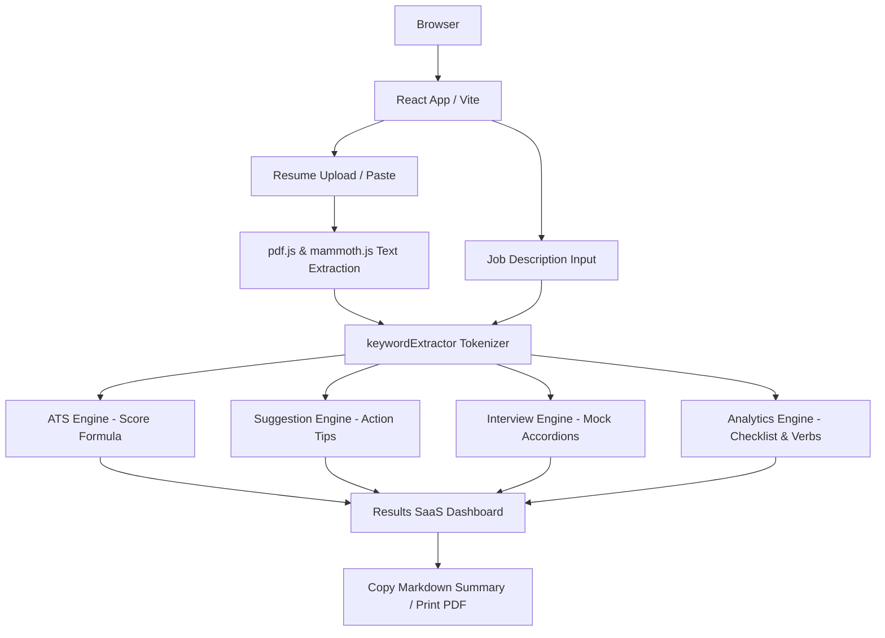

# ResumeIQ – Smart ATS Analyzer & Interview Assistant

> **Upload • Analyze • Improve • Prepare**
> A premium, privacy-first SaaS platform designed to help candidates optimize resumes for ATS bots and prepare for technical interviews entirely client-side.

---

## 🚀 Project Overview

**ResumeIQ** is a 100% free web application that operates entirely within the user's browser. Candidates can upload their resumes (PDF, DOCX, or TXT), paste a target job description, and instantly receive:
1. **ATS Compatibility Match Score**: Calculated deterministically based on keyword overlaps.
2. **Resume Strength Analysis**: Color-coded progress metrics reflecting overall readability.
3. **Keyword Overlap Audits**: Side-by-side displays of matching (green) and missing (orange) terms.
4. **Skill Area Categorization**: Dynamic classification of requirements into functional groups (e.g., Frontend, Cloud, databases).
5. **Actionable Suggestions**: Specific instructions mapping to missing keyword credentials.
6. **Tailored Interview Questions**: Accordion-based mock interview preparation cards mapped to identified resume skills.
7. **Vocabulary & Landmarking Analytics**: Word metrics, action verb counters, and links extraction.
8. **ATS Checklist**: Structural checks validation (Education, Projects, GitHub link, Email, etc.).

---

## ❌ The Problem We Solve

Standard online ATS checkers:
- Require registrations, paid subscriptions, or email signups.
- Limit users to 1-2 free scans daily.
- Upload resumes to remote cloud servers, creating privacy risks for personal contact details.
- Provide complex, unintuitive, and sluggish interfaces.

**Our Solution**: ResumeIQ executes **100% client-side** using in-browser parsing engine utilities (`pdfjs-dist` & `mammoth.js`). Your resume never leaves your computer, and you get infinite, fast, high-quality compatibility reviews for free.

---

## 🛠️ Tech Stack

- **Core Framework**: React (Vite)
- **Language**: JavaScript (ES6+)
- **Styling**: Pure CSS (Modern Design System, CSS Variables, Responsive, Dark Mode)
- **Document Parsing**: 
  - `pdfjs-dist` (Mozilla PDF Parser)
  - `mammoth.js` (DOCX to raw text converter)
- **Icons**: `lucide-react`
- **Deployment**: Vercel Hobby Plan (Static Hosting)

---

## 🗺️ Application Architecture



---

## 📁 Folder Structure

```
resume/
├── public/                # Static asset files
├── src/
│   ├── assets/            # App graphic assets
│   ├── components/        # React UI Elements
│   │   ├── Header.jsx             # Top navigation & theme toggle
│   │   ├── Hero.jsx               # Introduction CTA screen
│   │   ├── ResumeUploader.jsx     # File dropzone & text paste inputs
│   │   ├── ResumePreview.jsx      # Extracted text inspector
│   │   ├── JobDescription.jsx     # Job terms textarea
│   │   ├── AnalyzeButton.jsx      # Comparison trigger
│   │   ├── Dashboard.jsx          # Results grid wrapper
│   │   ├── ScoreCard.jsx          # Circle match meter
│   │   ├── StrengthCard.jsx       # Rating rating badge
│   │   ├── KeywordList.jsx        # Match vs missing pills
│   │   ├── SkillCategories.jsx    # Tech classification lists
│   │   ├── Suggestions.jsx        # Structural advice cards
│   │   ├── InterviewQuestions.jsx # Mock prep accordions
│   │   ├── Analytics.jsx          # Word details & verbs
│   │   ├── Checklist.jsx          # ATS document checklist
│   │   ├── ReportActions.jsx      # TXT/PDF exports
│   │   └── Footer.jsx             # Credits and outgoing links
│   ├── utils/             # Core engines
│   │   ├── pdfExtractor.js        # File buffers extraction
│   │   ├── keywordExtractor.js    # Normalization & token filter
│   │   ├── atsEngine.js           # ATS overlap matching
│   │   ├── suggestionEngine.js    # Missing skills mapping
│   │   ├── interviewEngine.js     # Tech question dictionary
│   │   ├── analyticsEngine.js     # Structural heuristics parser
│   │   └── constants.js           # Skills databases & demo data
│   ├── App.jsx            # Application layout coordinator
│   ├── main.jsx           # Entrypoint render
│   └── styles.css         # Theme stylesheet and design system
├── package.json           # Modules and script configurations
├── vite.config.js         # Bundler settings
├── LICENSE                # MIT License
└── README.md              # Documentation
```

---

## ⚙️ Installation & Running Locally

### Prerequisites
Make sure you have [Node.js](https://nodejs.org/) installed (v16+ recommended).

### Steps
1. **Clone the repository:**
   ```bash
   git clone https://github.com/ishwari-patil/resume-ats-interview-assistant.git
   cd resume-ats-interview-assistant
   ```

2. **Install dependencies:**
   ```bash
   npm install
   ```

3. **Start the development server:**
   ```bash
   npm run dev
   ```
   Open your browser and navigate to `http://localhost:5173` to view the app!

4. **Build the production bundle:**
   ```bash
   npm run build
   ```

---

## 🎨 Design Aesthetics & Color Palette

ResumeIQ is styled with a premium modern SaaS appearance inspired by Linear, Stripe, and Vercel. Features clean glassmorphism, responsive grids, micro-interactions, dark mode, and a typography system centered on **Inter**.

- **Background**: `#F8FAFC` (Light) / `#0F172A` (Dark)
- **Surface Cards**: `#FFFFFF` (Light) / `#1E293B` (Dark)
- **Primary Indigo**: `#2563EB` (Light) / `#3B82F6` (Dark)
- **Success Emerald**: `#22C55E` (Light) / `#10B981` (Dark)
- **Warning Amber**: `#F59E0B`
- **Danger Red**: `#EF4444`

---

## 🔒 Security & Privacy

Since all extraction and keyword comparisons occur locally in your browser's memory, **no data is ever transmitted to a server**. This ensures complete privacy for your name, phone number, address, email, and work history.

---

## ✍️ Developer Portfolio Credits

- **Developed By**: Ishwari Ajaykumar Patil
- **Contact Email**: [ishwari.patil24@vit.edu](mailto:ishwari.patil24@vit.edu)
- **Institution**: Vishwakarma Institute of Technology, Pune
- **Project Goal**: Built for digital heroes as a contribution to simple, free, and privacy-focused career tools.

[](https://digitalheroesco.com)

---

## 📄 License
Distributed under the **MIT License**. See `LICENSE` for details.
